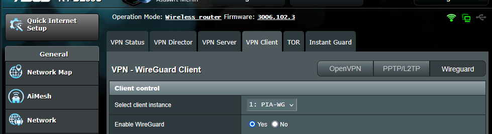

# Private Internet Access - WireGuard (with Merlin router support)
Adding to https://github.com/hsand/pia-wg/pull/13, add scripts to automatically update Merlin Router WireGuard Settings.  This is because the configuation must be updated, perhaps on a biweekly basis.

How it works:
1. Generate the config file using the Python script `generate_config.py`. This will generate a standard wg config file.
2. Parse the most newly generated config file using bash scripts.
3. SSH into your router by reading the router credentials on the `router.yaml` file.
4. Update the nvram variables on the router (adjust the bash script accordingly for your router).
5. commit the changes.


I am only adding the Linux support, but it may be translated for Windows. Tested on 3006.102.3 firmware:

## Step 0 - Router Firmware
Ensure your router merlin firmware supports WireGuard.  Older firmware do not support it!


## Step 1 - Create `config.yaml` file

```yaml
pia:
    username: PIA_USERNAME
    password: PIA_PASSWORD
    region: PIA_REGION (see below)
```

## Step 2 - Create Router ssh config `router.yaml` file
```yaml
router:
    ip: 192.168.1.1 (may be different for you)
    username: ROUTER_USERNAME
    password: ROUTER_PASSWORD
```

## Step 3 - Verify the nvram variables are consistent with your router in the `update_merlin_pia.sh` script.
Use `nvram show | grep -i INSERT_SUBSTRING_HERE` to find the variables.  The easiest way is to use the previous settings already stored in your router.

```shell
SSH_CMD="nvram set wgc1_addr=${ADDRESS}; nvram set wgc_addr=${ADDRESS}; \
nvram set wgc1_priv=${PRIVATE_KEY}; nvram set wgc_priv=${PRIVATE_KEY}; \
nvram set wgc1_dns='${DNS}'; nvram set wgc_dns='${DNS}'; \
nvram set wgc1_ppub=${PUB_KEY}; nvram set wgc_ppub=${PUB_KEY}; \
nvram set wgc1_ep_addr=${ENDPOINT}; nvram set wgc1_ep_addr_r=${ENDPOINT}; nvram set wgc_ep_addr=${ENDPOINT}; \
nvram set wgc_aips='0.0.0.0/0'; nvram set wgc1_aips='0.0.0.0/0'; nvram commit"
```

## Step 4 - Create a cron job for `update_merlin_pia.sh` (or Automated Tasks on Windows)
Create a cronjob to automate the update. For example, to update it on a weekly basis:
```shell
(crontab -l; echo "0 0 * * 0 /path/to/your/script.sh") | crontab -
```
Don't forget to update the permissions
```shell
chmod +x /path/to/your/script.sh
```

# WireGuard Utility

A WireGuard configuration utility for Private Internet Access

This is a Python utility that generates WireGuard configuration files for the Private Internet Access VPN service. This allows you to take advantage of the WireGuard protocol without relying on PIA's proprietary client.

This was created by reverse engineering the [manual-connections](https://github.com/pia-foss/manual-connections) script released by PIA. At this stage, the tool is a quick and dirty attempt to get things working. It could break at any moment if PIA makes changes to their API.

pia-wg runs on both Windows and Linux.

## Windows
* Install the latest version of [Python 3](https://www.python.org/downloads/windows/)
  * Select "Add Python to environment variables"
* Install [WireGuard](https://www.wireguard.com/install/)

Open a command prompt and navigate to the directory where you placed the pia-wg utility. The following commands will create a virtual Python environment, install the dependencies, and run the tool.

```
python -m venv venv
venv\Scripts\activate
pip install -r requirements.txt
python generate-config.py
```

Follow the prompts. When finished, you can exit the virtual environment with the `deactivate` command.

The script should generate a `.conf` file that can be imported into the WireGuard utility.

## Linux (Debian/Ubuntu)
Install dependencies, clone pia-wg project, and create a virual Python environment:
```
sudo apt install git python3-venv wireguard openresolv
git clone https://github.com/hsand/pia-wg.git
cd pia-wg
python3 -m venv venv
source venv/bin/activate
pip install -r requirements.txt
```

Run the tool, and follow the prompts
```
python generate-config.py
```

Copy the `.conf` file to `/etc/wireguard/`, and start the interface
```
sudo cp PIA-Iceland-1605054556.conf /etc/wireguard/wg0.conf
sudo wg-quick up wg0
```

You can shut down the interface with `sudo wg-quick down wg0`


## Check everything is working
Visit https://dnsleaktest.com/ to see your new IP and check for DNS leaks.

## Options

The following options are supported:

```
$ ./generate-config.py -h
usage: generate-config.py [-h] [-r] [--sort-latency] [-f CONFIG]

Generate PIA wireguard config

optional arguments:
  -h, --help            show this help message and exit
  -r , --region         Allowed values are AU Adelaide, AU Brisbane, AU
                        Melbourne, AU Perth, AU Sydney, Albania, Algeria,
                        Andorra, Argentina, Armenia, Australia Streaming
                        Optimized, Austria, Bahamas, Bangladesh, Belgium,
                        Bolivia, Bosnia and Herzegovina, Brazil, Bulgaria, CA
                        Montreal, CA Ontario, CA Ontario Streaming Optimized,
                        CA Toronto, CA Vancouver, Cambodia, Chile, China,
                        Colombia, Costa Rica, Croatia, Cyprus, Czech Republic,
                        DE Berlin, DE Frankfurt, DE Germany Streaming
                        Optimized, DK Copenhagen, DK Streaming Optimized, ES
                        Madrid, ES Valencia, Ecuador, Egypt, Estonia, FI
                        Helsinki, FI Streaming Optimized, France, Georgia,
                        Greece, Greenland, Guatemala, Hong Kong, Hungary, IT
                        Milano, IT Streaming Optimized, Iceland, India,
                        Indonesia, Ireland, Isle of Man, Israel, JP Streaming
                        Optimized, JP Tokyo, Kazakhstan, Latvia,
                        Liechtenstein, Lithuania, Luxembourg, Macao, Malaysia,
                        Malta, Mexico, Moldova, Monaco, Mongolia, Montenegro,
                        Morocco, NL Netherlands Streaming Optimized, Nepal,
                        Netherlands, New Zealand, Nigeria, North Macedonia,
                        Norway, Panama, Peru, Philippines, Poland, Portugal,
                        Qatar, Romania, SE Stockholm, SE Streaming Optimized,
                        Saudi Arabia, Serbia, Singapore, Slovakia, Slovenia,
                        South Africa, South Korea, Sri Lanka, Switzerland,
                        Taiwan, Turkey, UK London, UK Manchester, UK
                        Southampton, UK Streaming Optimized, US Alabama, US
                        Alaska, US Arkansas, US Atlanta, US Baltimore, US
                        California, US Chicago, US Connecticut, US Denver, US
                        East, US East Streaming Optimized, US Florida, US
                        Honolulu, US Houston, US Idaho, US Indiana, US Iowa,
                        US Kansas, US Kentucky, US Las Vegas, US Louisiana, US
                        Maine, US Massachusetts, US Michigan, US Minnesota, US
                        Mississippi, US Missouri, US Montana, US Nebraska, US
                        New Hampshire, US New Mexico, US New York, US North
                        Carolina, US North Dakota, US Ohio, US Oklahoma, US
                        Oregon, US Pennsylvania, US Rhode Island, US Salt Lake
                        City, US Seattle, US Silicon Valley, US South
                        Carolina, US South Dakota, US Tennessee, US Texas, US
                        Vermont, US Virginia, US Washington DC, US West, US
                        West Streaming Optimized, US West Virginia, US
                        Wilmington, US Wisconsin, US Wyoming, Ukraine, United
                        Arab Emirates, Uruguay, Venezuela, Vietnam
  --sort-latency        Display lowest latency regions first (requires root)
  -f CONFIG, --config CONFIG
                        Name of the generated config file

$ ./configure-ros.py -h
usage: configure-ros.py [-h] [-d] -i INTERFACE -f CONFIG

Configure RouterOS with wireguard config

optional arguments:
  -h, --help            show this help message and exit
  -d, --delete
  -i INTERFACE, --interface INTERFACE
  -f CONFIG, --config CONFIG
```

## Config file

You can store your username, password, and region in a `config.yaml` file in the same directory as the script:
```
pia:
    username: pXXXXXXX
    password: 1234567890abcde
    region: "AU Melbourne"
```
